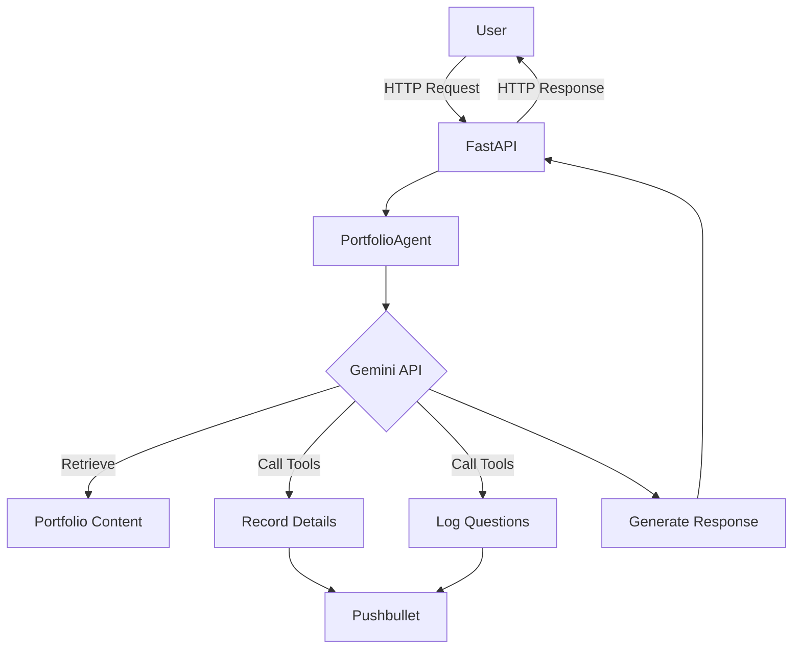

# Portfolio Assistant: Autonomous Agent for Portfolio Data Retrieval

<div align="center">
  


</div>

--- 


Portfolio Assistant is an advanced AI agent that provides real-time portfolio data acquisition and semantic synthesis. This autonomous system uses Large Language Models (LLMs) to intelligently answer questions about projects, skills, and experience while incorporating custom tool-calling mechanisms for enhanced flexibility.


**Key Features:**
- 🧠 Intelligent question answering about portfolio content
- 🔄 API key rotation for robust performance
- 📝 Automated logging of user interactions
- 📱 Push notifications for important events
- ⚙️ Custom tool integration for extended functionality

## How It Works



The system architecture consists of:

1. **FastAPI Server**: Handles HTTP requests and CORS
2. **Portfolio Assistant**: Core agent processing logic
3. **Gemini API**: LLM for knowledge retrieval and response generation
4. **Tool Integration**: Custom functions for recording user data
5. **Notification System**: Pushbullet integration for alerts

## Key Technologies

- **Python 3.9+**
- **FastAPI** (Web framework)
- **Gemini API** (LLM service)
- **Pushbullet** (Notification service)
- **Pydantic** (Data validation)
- **dotenv** (Environment management)

## Setup and Installation

### Prerequisites
- Python 3.9 or higher
- Gemini API keys (set as environment variables)
- Pushbullet API key (optional for notifications)

### Installation Steps

1. Clone the repository:
```bash
git clone https://github.com/yourusername/portfolio-agent.git
cd portfolio-agent
```

2. Create and activate virtual environment:
```bash
python -m venv venv
source venv/bin/activate  # Linux/Mac
venv\Scripts\activate     # Windows
```

3. Install dependencies:
```bash
pip install -r requirements.txt
```

4. Create `.env` file with your credentials:
```env
KNOWLEDGE_URL="https://your-portfolio-content.com"
GEMINI_API_KEY_1="your-gemini-key-1"
GEMINI_API_KEY_2="your-gemini-key-2"
PUSHBULLET_API_KEY="your-pushbullet-key"
```

5. Run the application:
```bash
uvicorn main:app --reload
```

## Configuration

| Environment Variable | Description | Required |
|----------------------|-------------|----------|
| `KNOWLEDGE_URL` | URL to portfolio content | Yes |
| `GEMINI_API_KEY_1` | Gemini API key 1 | At least one |
| `GEMINI_API_KEY_2` | Gemini API key 2 | Optional |
| `PUSHBULLET_API_KEY` | Pushbullet API key | No |
| `CHAT_LOG_PATH` | Path to chat logs | No |

## API Documentation

### POST `/chat`

Send a message to the portfolio assistant:

**Request:**
```json
{
  "message": "What projects have you worked on?",
  "history": [
    ["Hello", "Hi! How can I help?"]
  ]
}
```

**Response:**
```json
{
  "response": "I've worked on several projects including..."
}
```

## Project Structure

```
autonomous-portfolio-agent/

├── portfolio_agent/
│   ├── agent.py           # Core AI agent logic
│   ├── tools.py           # Custom tool-calling functions
│   ├── config.py          # Environment configuration
│   ├── logger.py          # Structured logging
│   ├── notifier.py        # Push notification system
├── main.py                # FastAPI server entry point
├── requirements.txt       # Python dependencies
├── .env                   # Environment variables
└── README.md
```

## Contributing

Contributions are welcome! Please follow these steps:

1. Fork the repository
2. Create your feature branch (`git checkout -b feature/amazing-feature`)
3. Commit your changes (`git commit -m 'Add some amazing feature'`)
4. Push to the branch (`git push origin feature/amazing-feature`)
5. Open a pull request

## License

This project is licensed under the MIT License - see the [LICENSE](LICENSE) file for details.

---